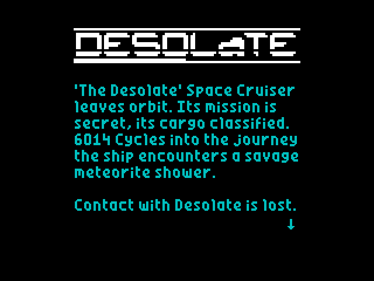
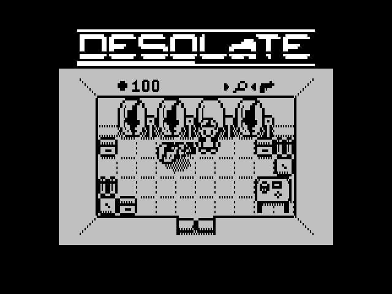
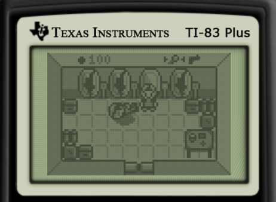
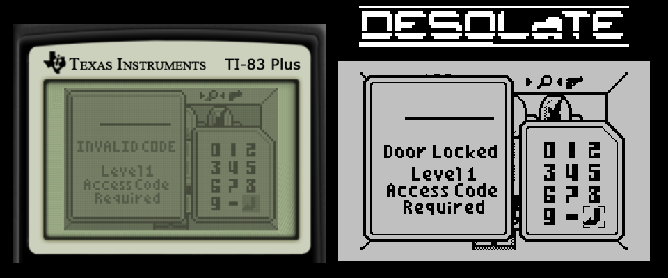

# spectrum-desolate
Ported **Desolate** game from TI-83 Plus calculator to ZX Spectrum.

Status: released.

Thanks a lot to tr1p1ea for the original game!
Thanks to [zx-pk.ru forum](https://zx-pk.ru/forum.php) members for all the help and support!

Videos:
 - [Desolate Walkthrough, ZX Spectrum](https://youtu.be/41zymtzSNes) by Pavel Plíva and RZX Archive
 - [Desolate (2021) Walkthrough + Review, ZX Spectrum](https://youtu.be/fsPbqdiyB0Y) by Modern ZX-Retro Gaming
 - [ZX Spectrum -=Desolate=-](https://youtu.be/ZGCxc-kQIGs) by Saberman for IndieRetroNews

## The original game

Written by Patrick Prendergast (tr1p1ea) for TI-83/TI-84 calculators.

Links:
 - [Desolate game description and files](https://www.ticalc.org/archives/files/fileinfo/348/34879.html)
 - [Wabbit emulator site](http://wabbitemu.org/) and [GitHub](https://github.com/sputt/wabbitemu)

To run the game on Wabbitemu emulator:
 1. Run Wabbitemu, select ROM file
 2. File Open `DesData.8xp`
 3. <kbd>MEM</kbd>, select Archive; <kbd>PRGM</kbd>, select DesData; <kbd>ENTER</kbd>
 4. File Open `Desolate.8xp`
 5. File Open `MIRAGEOS.8xk`
 6. <kbd>APPS</kbd> select MirageOS
 7. Select Main > Desolate

## Comparing original to the port

## Tools for the tools folder

 - `bas2tap.exe`, `bin2tap.exe`, `tap2tzx.exe` utilities
   https://sourceforge.net/projects/zxspectrumutils/files/

 - `pasmo.exe` cross-assembler
   http://pasmo.speccy.org/

 - `sjasmplus.exe`
   https://github.com/z00m128/sjasmplus/releases

 - `lzsa.exe`
   https://github.com/emmanuel-marty/lzsa/releases

## Links

 - [Discussion on zx-pk.ru (in Russian)](https://zx-pk.ru/threads/32431-desolate-port-s-ti-83-plus.html)
 - [Discussion on Spectrum Computing forum](https://spectrumcomputing.co.uk/forums/viewtopic.php?f=9&t=4263)
 - [Desolate port on Vector-06c](https://github.com/nzeemin/vector06c-desolate)
 - [Desolate port on UKNC](https://github.com/nzeemin/uknc-desolate)

