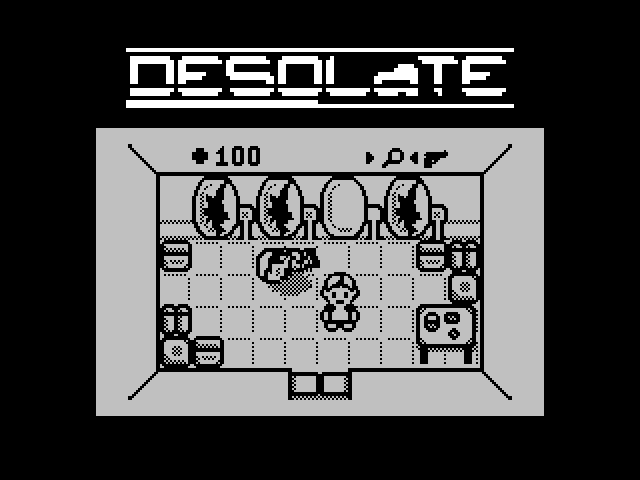

# spectrum-desolate
Porting Desolate game from TI-83 Plus calculator to ZX Spectrum.

## The original game

## The port to ZX Spectrum

Status: work in progress.

## Tools for the bin folder

 - `bas2tap.exe` and `tap2tzx.exe`
   https://sourceforge.net/projects/zxspectrumutils/files/

 - `pasmo.exe`
   http://pasmo.speccy.org/

 - `sjasmplus.exe`
   https://github.com/z00m128/sjasmplus/releases

